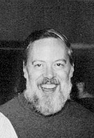

 

* 1943: Föddes i New Orleans
* 1968: [Reguljära uttryck](https://www.oilshell.org/archive/Thompson-1968.pdf)
* 1969: [B](https://en.wikipedia.org/wiki/B_(programming_language)), föregångare till [C](https://en.wikipedia.org/wiki/C_(programming_language))
* 1970: [Unix](https://en.wikipedia.org/wiki/Unix) med Dennis Ritchie
* 1973: [grep](https://en.wikipedia.org/wiki/Grep)
* **1976**: [Belle](https://en.wikipedia.org/wiki/Belle_(chess_machine)) med Joe Condon
	* Första specifika schackhårdvaran.
	* Draggenerering 
	* Ställningsutvärdering 
	* Dragomkastningstabell
	* alpha-beta Pruning (uppsnabbning av minimax)
	* Generation 3 hanterade 100-200 tusen drag per sekund.
* **1978**: Vann [US Computer Chess Championship](https://en.wikipedia.org/wiki/North_American_Computer_Chess_Championship)
* **1977**: [Första slutspelsdatabasen](https://en.wikipedia.org/wiki/Endgame_tablebase)
* **1980**: Vann US Computer Chess Championship
* **1980**: Vann [World Computer Chess Championship](https://en.wikipedia.org/wiki/World_Computer_Chess_Championship)
* **1981**: Vann US Computer Chess Championship
* **1982**: Vann US Computer Chess Championship
* **1983**: Belle utsedd till US Chess Master med rating 2250
* **1986**: Vann US Computer Chess Championship
* 1992: [UTF-8](https://en.wikipedia.org/wiki/UTF-8) med Rob Pike
* 2009: [Go](https://en.wikipedia.org/wiki/Go_(programming_language)) med Robert Griesemer och Rob Pike
* [Intervju med Brian Kernighan](https://youtu.be/EY6q5dv_B-o?si=BZgbZfzNzxmCeTcM)
* [Wikipedia](https://en.wikipedia.org/wiki/Ken_Thompson)
* [Tiobe](https://www.tiobe.com/tiobe-index/) 
